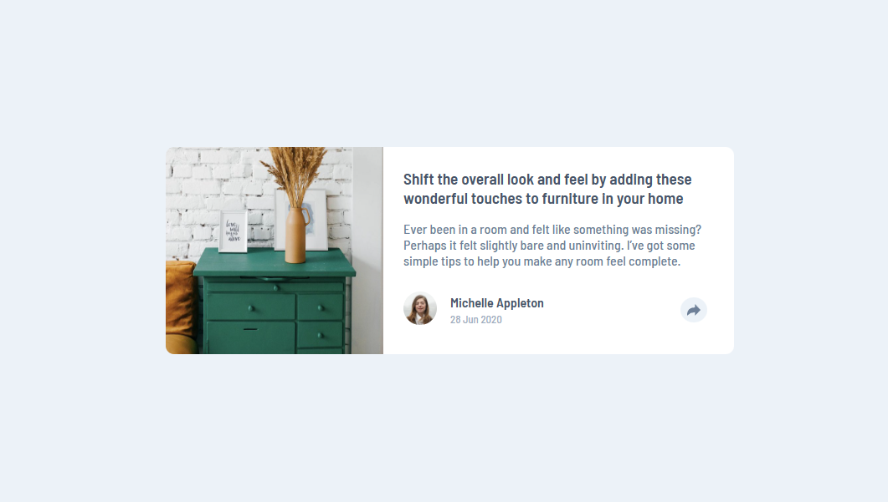

# Frontend Mentor - Article preview component solution

This is a solution to the [Article preview component challenge on Frontend Mentor](https://www.frontendmentor.io/challenges/article-preview-component-dYBN_pYFT). Frontend Mentor challenges help you improve your coding skills by building realistic projects. 

## Table of contents

- [Overview](#overview)
  - [The challenge](#the-challenge)
  - [Screenshot](#screenshot)
  - [Links](#links)
- [My process](#my-process)
  - [Built with](#built-with)
  - [What I learned](#what-i-learned)
  - [Useful resources](#useful-resources)
- [Author](#author)

## Overview

### The challenge

Users should be able to:

- View the optimal layout for the component depending on their device's screen size
- See the social media share links when they click the share icon

### Screenshot

### Links

- Live Site URL: [My Solution Site](https://article-preview-component-jade-seven.vercel.app/)

## My process

### Built with

- Semantic HTML5 markup
- CSS custom properties
- Flexbox
- CSS Grid

### What I learned

- CSS Flexbox
- CSS Tooltip
- Responsiveness
- JS EventListener

### Useful resources

- [CSS Flexbox](https://css-tricks.com/snippets/css/a-guide-to-flexbox/) - This helped me for setting flexbox.
- [CSS Tooltip](https://www.w3schools.com/css/css_tooltip.asp) - This helping me to make tooltip

## Author

- Frontend Mentor - [@Ghozy165](https://www.frontendmentor.io/profile/Ghozy165)
